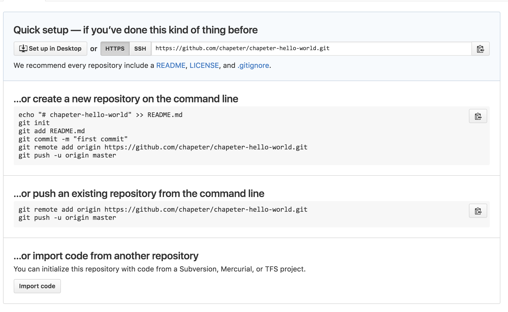

# DevOps/Network Programmability - Introductory Laptop Setup

[item]: # (slide)


### Brought to you by [imapex.io](http://imapex.io)

[item]: # (/slide)


[item]: # (slide)
## Goals

 This session will focus on getting your laptops ready to demonstrate a series of network programmability tools and use cases
 with their customers. Specifically, you will leave with the following installed and working
 * Git
 * Docker
 * PyCharm IDE

[item]: # (/slide)
[item]: # (slide)

## Downloads

Please start the following downloads for your platform

* PyCharm Community Edition
    * https://www.jetbrains.com/pycharm/download/
    * Google "pycharm download"
* Git
    * https://git-scm.com/downloads
    * Google "git download"
* Docker
    * https://docs.docker.com/engine/installation/
    * Google "docker download"
      * Mac - Docker for Mac
      * Windows 10 - Docker for Windows
      * Windows 7/8 - Docker Toolbox
      * (guide written for Docker for X, not toolbox)

[item]: # (/slide)

[item]: # (slide)

## Downloads(cont.)

If you are on Windows 7 or 10 you will also want the following

* Python - 2.7 or 3.5
    * Already installed on Mac
    * [https://www.python.org/downloads/](https://www.python.org/downloads/)
* Powershell v3 or higher
    * [https://www.microsoft.com/en-us/download/details.aspx?id=34595](https://www.microsoft.com/en-us/download/details.aspx?id=34595)
* 7zip
    * [www.7-zip.org/download.html](www.7-zip.org/download.html)

[item]: # (/slide)

[item]: # (slide)

## Python Install - Windows Users 2.7
Ensure you check the "Add Python to PATH" box!!!


[item]: # (/slide)

[item]: # (slide)

## Python Install - Windows Users 3.5
Ensure you check the "Add Python to PATH" box!!!


[item]: # (/slide)


[item]: # (slide)
## Windows 7zip
After installing 7zip add 7zip to your environment variables

```
set PATH=%PATH%;C:\Program Files\7-Zip\
echo %PATH%
7z
```
[item]: # (/slide)


[item]: # (slide)

## Integrated Development Environment (IDE)

An integrated development environment (IDE) is a software application that provides comprehensive facilities to computer
programmers for software development.

https://en.wikipedia.org/wiki/Integrated_development_environment


[item]: # (/slide)
[item]: # (slide)

## IDE Components

* Source Code Editor
* Version Control Integration
* Build / Deployment tools
* Debugging Tools
* Code completion
* Static Code Analysis

[item]: # (/slide)
[item]: # (slide)

## Popular IDE's (Python)

* **Pycharm**
* Eclipse
* Atom
* Sublime
* Komodo


[item]: # (/slide)

[item]: # (slide)

## PyCharm Installation

* Install PyCharm Community Edition
    * https://www.jetbrains.com/pycharm/download/
    * Google "pycharm download"


[item]: # (/slide)
[item]: # (slide)

## Creating a new project

* Create a new project called hello-world
* Create a new file inside project directory
    * hello.py
        ```
        print("Hello, World!")
        ```
* Run the file using PyCharm

[item]: # (/slide)
[item]: # (slide)


## Git

* Most widely used version control system in the world
* Distributed
* Originally Developed by Linus Torvalds (Linux)

[item]: # (/slide)
[item]: # (slide)


## Github

* Web based repository (repo) hosting service
* Adds additional features such as
    * Collaboration
    * Bug Tracking
    * Feature Requests
    * Project Wikis
* 18M+ Users
* 50M+ Projects

[item]: # (/slide)
[item]: # (slide)

## Install Git

* Run the Gitb installer you downloaded earlier
* Mac users may already have git installed (check ```git help``` from a terminal session)

[item]: # (/slide)
[item]: # (slide)

## Creating a repository on github

* Register a github.com account if you haven't already
* Create a new repository called "USERID-hello-world"

**NOTE:** make sure and substitute your userid into this step, otherwise you will have problems later




[item]: # (/slide)

[item]: # (slide)
## Setup your git Credentials
Make sure git has been configured with your contact information

```
git config --global user.name 'Your Name'
git config --global user.email you@somedomain.com

```


[item]: # (/slide)

[item]: # (slide)

## Initializing your local repository

* Open a terminal window and navigate to your "USERID-hello-wold" project
* Follow the quickstart instructions from Github Quick Start to accomplish the following


[item]: # (/slide)

[item]: # (slide)
## Initializing your local repository(cont.)

* Refresh the page
* Do you see your code?  Why not?


[item]: # (/slide)
[item]: # (slide)

## Checking the status of your repository

* Run the following command from your terminal
    ```
    git status

    ```
* Files must be explicitly checked in / tracked by git
* Add your hello.py to version control

    ```
    git add hello.py

    ```
    This adds the file to the *staging index* which means it will be added in the next commit

[item]: # (/slide)
[item]: # (slide)

## Commit

A *commit* creates a record of changes to your repository.

A commit contains the following information
* All files which have been added or changed in the staging index
* Username and Email address of the user who made the changes

[item]: # (/slide)
[item]: # (slide)

## Commit (cont'd')

Commit hello.py to your local repository

```
git commit -m "added hello.py"
```

[item]: # (/slide)
[item]: # (slide)

## Remotes

* There now exists two copies of your hello-world repository
    * Your local laptop
    * github.com

[item]: # (/slide)
[item]: # (slide)

## Remotes

* The copy on github.com is referred to as a *remote* view the configuration of
 this with the following command

    ```
    cat .git/config
    ```
* Note the following lines

   ```
   [remote "origin"]

   [branch "master"]
   ```
* Branches will be covered lately, but the we can now reference the URL of our repository on github with the origin keyword.

[item]: # (/slide)
[item]: # (slide)


## Push

Our two copies of the hello-world repository are not sync'd automatically, to sync them
we need to *push* our local commits to the *remote* copy stored on github

We will push our local changes to the *origin* (github) on the *master* branch

```
git push origin master
```

Refresh the github page and verify that your hello.py file exists

[item]: # (/slide)
[item]: # (slide)

## Forking

Forking allows you to create your own copy of someone elses repository which you have full control to use
and modify as you like.

* Navigate to your lab partners github repostiory

    * https://github.com/LAB-PARTNERS-USERID/USERID-hello-world

* Click on the fork button in the upper right hand corner of the screen

* You now have a copy of their repository in your github account

[item]: # (/slide)
[item]: # (slide)

## Cloning

* In the previous exercises, we created a local repository, and created a copy on a remote server (github)

* Cloning is the opposite, we will take a remote repository and copy it to our local development

* Run the following commands:

    ```
    cd ~
    git clone https://github.com/LAB-PARTNERS-USERID/USERID-hello-world forked-repo

    ```

    This command creates a new directory called forked-repo which contains your partners version of the hello-world project

[item]: # (/slide)
[item]: # (slide)

## Contributing!!!

* Open your partners repository using PyCharm
* Add the following line to the hello.py file
    ```
    print("Put me in coach, I'm ready to play!")
    ```
* Add the modified version of hello.py to your staging index

    ```
    git add hello.py
    ```
* Commit your change
    ```
    git commit -m "modified hello.py"

    ```
* Push your change

    ```
    git push origin master
    ```

Now origin refers to your fork of your partners repository

[item]: # (/slide)
[item]: # (slide)

## Pull requests

When you've made changes to your fork of someone elses repository, you can request that the incorporate those
changes into their repository as well by opening a *pull request*

* Navigate to **your** fork of your partners repository
* Make sure that the hello.py file shows the commit that you made
* Click on the "New Pull Request"
* Review the proposed changes, and make sure the line you added is there
* Click on the "Create New Pull Request Button"

[item]: # (/slide)
[item]: # (slide)


## Merging

When a pull request is open, if the changes are acceptable the request can be merged into your code base

* Using github, navigate to **your** hello-world repository
* You should see a pull request from your partner
* Merge the pull request into your repository

[item]: # (/slide)
[item]: # (slide)

# Congratulations!!!!

You have now successfully done the following:

* Created a repository
* Committed code
* Pushed Commits to github
* Forked a repository
* Created a pull requested
* Merged a pull request

[item]: # (/slide)

##Learn more
* [https://github.com/imapex-training/mod_adv_git](https://github.com/imapex-training/mod_adv_git)


[item]: # (slide)

# Docker


[item]: # (/slide)
[item]: # (slide)


# Docker installation

* Install Docker from the installer you downloaded already (hopefully)
* Verify your installation using the following command
    ```
    docker info
    ```

[item]: # (/slide)
[item]: # (slide)

# Images

An image is an immutable file that's essentially a snapshot of a container.

* Created with the `docker build` command
* Used to instantiate a container using `docker run`
* Can be downloaded from docker hub using the `docker pull command`
* Consist of a set of layers (changes)

[item]: # (/slide)
[item]: # (slide)

# Managing Images

Lets start by downloading a common image called python:slim

```
docker pull python:slim
```

You can verify the images you have available locally with the following command

```
docker images
```

[item]: # (/slide)
[item]: # (slide)

## Running a container

Launching a container based on the python:slim image

```
docker run -ti python:slim echo hello

```
This command starts a new container, runs the `echo hello` and exits

You can see a list of containers which are currently running using the following command

```
docker ps
```
Because the container we started has already exited it is not listed using this command alone, to see all
containers, add the --all flag

```
docker ps --all
```

You should see something similar to the following

```
CONTAINER ID        IMAGE                 COMMAND                  CREATED             STATUS                      PORTS                    NAMES
f8ba379a6780        python:slim                "echo hello"             2 minutes ago       Exited (0) 2 minutes ago
```

[item]: # (/slide)
[item]: # (slide)

## Running a container interactively

Now we will run the following command

```
docker run -i -t python:slim /bin/sh
```
This tells docker to start a container interactively (-i) and to allocate a tty session (-t).  These options can also
be grouped together (-it)

You now have a container running, and have an interactive shell

You can exit the container, by closing the shell using:

```
exit
```

[item]: # (/slide)
[item]: # (slide)

## Containers are ephemeral

Explore the following commands

Start a new container

```
docker run -it python:slim /bin/sh

```

Create a new file

```
touch /myfile.txt
```

Verify the file was created
```
ls /myfile.txt
```

Exit the container

```
exit

```

[item]: # (/slide)
[item]: # (slide)

## Containers are ephemeral (cont)

Start another container using the same image
```
docker run -it python:slim /bin/sh

```

Check for the file we created
```
ls /myfile.txt
```

[item]: # (/slide)
[item]: # (slide)

## Containers are ephemeral (cont)

Each container is based off the image, to have changes persist, we need to create a new image for this

There are two ways to create an image
* Commit an existing container
* Using a Dockerfile

[item]: # (/slide)
[item]: # (slide)


## Creating an image from an existing container

* Start a new container from the image
    ```
    docker run -it python:slim /bin/sh

    ```
* Create a new file
    ```
    touch /myfile.txt
    ```

* Exit the container
    ```
    exit
    ```
* Get the container id from the `docker ps -a` command

```
CONTAINER ID        IMAGE                 COMMAND                  CREATED             STATUS                           PORTS                    NAMES
ee3d5d30a555        python:slim           "/bin/sh"                11 seconds ago      Exited (0) 3 seconds ago
```

[item]: # (/slide)
[item]: # (slide)

## Creating an image from an existing container(cont)

* Create a new image using `docker commit`

```
docker commit ee3d5d30a555 myimage
```

* Verify the image shows up in `docker images`
* Start another container with the following command
```
docker run -it myimage /bin/sh
```
* Verify the file is present the new container
```
ls /myfile.txt
```

[item]: # (/slide)
[item]: # (slide)

# Creating an image from a Dockerfile

* Create a file called `Dockerfile` in your project directory
    ```
    FROM python:slim
    COPY . /app
    CMD python /app/hello.py
    ```
* Build an image from your Dockerfile
    ```
    docker build -t myimage .
    ```
* Start a new container using your image
    ```
    docker run myimage
    ```

[item]: # (/slide)
[item]: # (slide)

## So What??!

Let's use the git and docker skills we've acquired to do something a bit more useful

1. Use git to clone the following repo

    https://github.com/datacenter/reattivio

2. Change to the reattivio directory

    ```
    cd reattivio
    ```

3. Create a docker image for this project

    ```
    docker build -t reattivio .
    ```

[item]: # (/slide)
[item]: # (slide)
## So What??! (cont)


4. Launch a container using your new image
    ```
    docker run -p 8080:80 reattivio
    ```

    The -p flag is specifying a port mapping from 8080 on your local maching to port 80 in the running container

[item]: # (/slide)

[item]: # (slide)

5. Launch your browser and point to http://127.0.0.1:8080

    You can point the tool to your lab APIC controller if you have one avaiable, if not you can use the DevNet Sandbox by using the following:

 * Address: sandboxapicdc.cisco.com
 * Username: admin
 * Password: 1vtG@lw@y
 * Use HTTPS

[item]: # (/slide)
[item]: # (slide)

# Conclusion

You should now have a basic understanding, and working environment with the following technologies

 * Git
 * Docker
 * PyCharm IDE

Now what?
* Hank Prestons session “DevOps and Network Programmability – Leveraging Code"
* IMAPEX training [https://github.com/imapex-training](https://github.com/imapex-training)

[item]: # (/slide)
